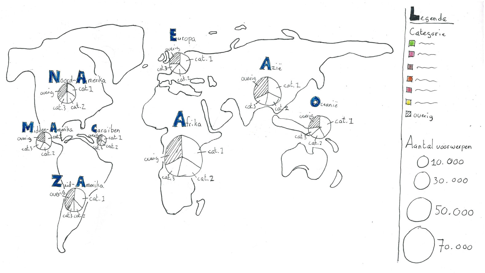

# Wereldkaart met populaire categorieën per continent en per land

Een interactieve wereldkaart met het totaal aantal voorwerpen en de verdeling van categorieën per continent en per land. De data is afkomstig van de collectie van het Nationaal Museum van Wereldculturen. Deze interactieve datavisualisatie is gemaakt met d3. Verder zijn Node.js en Express gebruikt voor het bouwen van de applicatie.



**[Bekijk interactieve wereldkaart](https://qiubee.github.io/frontend-data/)**

## Concept

Een interactieve datavisualisatie waarmee je de collectie van het Nationaal Museum van Wereldculturen kunt verkennen. Kijk op de wereldkaart waar objecten in de collectie zijn gevonden. Elk object in de collectie is gecategoriseerd. Met een cirkeldiagram worden de categorieën met de meeste objecten weergegeven. Klik op een van deze cirkels om dieper de collectie in te duiken om te ontdekken wat er verborgen zit in de collectie.

## Benodigdheden

* Node.js
* Express
* d3

Andere benodigdheden zijn te vinden in [`package.json`](https://github.com/qiubee/frontend-data/blob/master/package.json)

## Installeren

Doe het volgende in de terminal om te installeren:

1. `git clone https://github.com/qiubee/frontend-data.git`
2. `npm install`
3. `npm start`

Ga naar `localhost:8000` in de browser om de interactieve visualisatie te bekijken.

## Data

De data is opgehaald uit de database van het NMVW. Het NMVW gebruikt daarvoor SPARQL. De data die wordt opgehaald bestaat uit:

* Continent
* Land
* Coördinaten van het land
* Hoofdcategorieën van objecten
* Totaal aantal objecten per categorie

Met deze SPARQL-query is het mogelijk de data op te halen:

```SPARQL
PREFIX dc: <http://purl.org/dc/elements/1.1/>
PREFIX dct: <http://purl.org/dc/terms/>
PREFIX skos: <http://www.w3.org/2004/02/skos/core#>
PREFIX edm: <http://www.europeana.eu/schemas/edm/>
PREFIX wgs84: <http://www.w3.org/2003/01/geo/wgs84_pos#>
PREFIX skos: <http://www.w3.org/2004/02/skos/core#>
PREFIX gn: <http://www.geonames.org/ontology#>

SELECT ?continent ?countryName ?lat ?long ?category (COUNT(?cho) AS ?objCount) WHERE {
  
  # CONTINENTEN
  # geeft alle continenten
  <https://hdl.handle.net/20.500.11840/termmaster2> skos:narrower ?geoTerm .
  ?geoTerm skos:prefLabel ?continent .

  # geeft per continent de onderliggende geografische termen
  ?geoTerm skos:narrower* ?allGeoTerms .

  # geeft objecten bij de onderliggende geografische termen
  ?cho dct:spatial ?allGeoTerms .

  # LANDEN
  # zoekt in GeoNames naar de naam van het land
  ?allGeoTerms skos:exactMatch/gn:parentCountry ?country .
  ?country gn:name ?countryName .

  # COORDINATEN
  # geeft de latitude en longtitude van het land
  ?country wgs84:lat ?lat .
  ?country wgs84:long ?long .
  
  # CATEGORIEEN
  # geeft alle hoofdcategorieen
  <https://hdl.handle.net/20.500.11840/termmaster2802> skos:narrower ?catTerm .
  ?catTerm skos:prefLabel ?category .
  
  # geeft per categorie alle onderliggende categorische termen
  ?catTerm skos:narrower* ?allCatTerms .
  
  # geeft objecten bij alle onderliggende categorische termen
  ?cho edm:isRelatedTo ?allCatTerms .
  
} GROUP BY ?continent ?countryName ?lat ?long ?category
ORDER BY DESC(?objCount)
```

## Licentie

**[MIT](https://github.com/qiubee/functional-programming/blob/master/LICENSE)**
